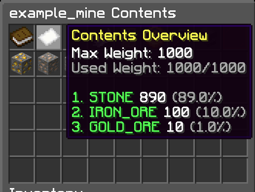
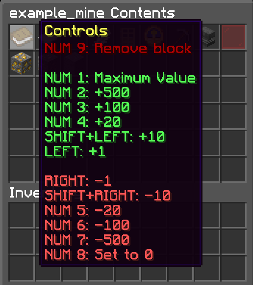

# PrisonMines
A lightweight and simple mines plugin for your Spigot server

### Features
 - Mine menus make editing your mines very easy
 - Supports as many mines as you need
 - A weight system for more specific mine customization than other plugins
 - Uses WorldEdit wand selection for mine sizing
 - Message customization

### Requirements
 - This plugin has two dependencies: [ServerUtils](https://www.spigotmc.org/resources/serverutils.106515/) and [WorldEdit](https://dev.bukkit.org/projects/worldedit) or [FAWE](https://www.spigotmc.org/resources/fastasyncworldedit.13932/)
 - Optional dependencies: [PlaceholderAPI](https://www.spigotmc.org/resources/placeholderapi.6245/)

### Save Data
 - Each mine is saved using its own file in the `/PrisonMines/mines` folder
 - All settings can be changed in-game using commands and the mine panel
 - If you wish to make manual edits, you need to reload the plugin after saving the mine's file
 - If there is a syntax error in your file, it will be reverted to a default state and all changes will be lost. It is advised that you make a backup before trying to load manual changes

### Commands
 - The only player command is `/mine <id>` which allows players to teleport to the mine's spawn. This command can be disabled through config.yml
   - Base permission `prisonmines.mine`
   - Per mine permission `prisonmines.mine.id` where id is the mine's id (specified on creation)

### Admin Commands
 - The base command is `pmine` (alias `mines`) with the permission `prisonmines.mineadmin`
 - All commands require permission to use which follows the format `prisonmines.mineadmin.command` where command is the name of the command
 - Note: arguments with <> are required and [] are optional
 - `/pmine clear <id>` Set the mine to air
 - `/pmine cloneContents <from> <to>` Clone a mine's contents from one mine to another
 - `/pmine create <id> [copyID]` Create a new mine (optional: clone a mine's settings/contents)
 - `/pmine delete <id>` Delete a mine
 - `/pmine help` Displays all commands
 - `/pmine panel [id]` Opens a menu displaying all mines or a mine's panel
 - `/pmine pauseResetting <id>` Toggle the mine's ability to reset
 - `/pmine reload [arg]` Reload the whole plugin or a specified part
 - `/pmine reset <id|all> [multiplier]` Reset all or one mine
   - The multiplier argument is only parsed when `all` is given. This is the minimum bound for the random reset time
 - `/pmine resize <id>` Update the mine's region to your WorldGuard selection
 - `/pmine setMaxWeight <id> <weight>` Updates a mine's max weight
 - `/pmine setName <id> <name>` Updates a mine's display name
 - `/pmine setResetPercent <id> <percent>` Updates the percent the mine should reset at
 - `/pmine setResetTime <id> <seconds>` Updates the time between mine resets
 - `/pmine setSpawnLocation <id> [x] [y] [z] [pitch] [yaw]` Sets a mine's spawn location (sets to your location if none is provided)
 - `/pmine spawn <id>` Go to a mine's spawn (does the same thing as `/mine <id>`)
 - `/pmine tpCenter <id>` Go to a mine's center point

### Mine Menus
 - Easily view the makeup of a mine

 - Easily change the makeup of a mine in this menu by clicking on a block

### Placeholders
 - Each placeholder needs a mine ID to link to an existing mine
 - `prisonmines_<id>_blocksremaining` Get the total number of solid blocks remaining
 - `prisonmines_<id>_name` Get the name of the mine
 - `prisonmines_<id>_percentmined` Get the percent of the mine that has been mined
 - `prisonmines_<id>_percentremaining` Get the percent of the mine that is remaining
 - `prisonmines_<id>_resetlength` Get the time between resets (formatted by default)
 - `prisonmines_<id>_resetpercentage` Get the percent that this mine will reset at
 - `prisonmines_<id>_timeuntilreset` Get the time until the next reset (formatted by default)
 - `prisonmines_<id>_volume` Get the total number of blocks in this mine
 - There are also additional placeholders for a mine's contents. Each content in the mine is internally labeled from 1 to n in the same order as they are listed in the panel's "Contents Overview" item
 - `prisonmines_<id>_contents_<num>_material` Get the Material of the block
 - `prisonmines_<id>_contents_<num>_percent` Get the percent of this block in the mine
 - Note: All "percent" placeholders give a number. You need to add the % sign after it.

### Additional Information
 - The maximum size of a mine is 2 million blocks
 - A mine can have at most 45 different blocks in it
 - A paused mine will resume if you force it to reset or restart the server
